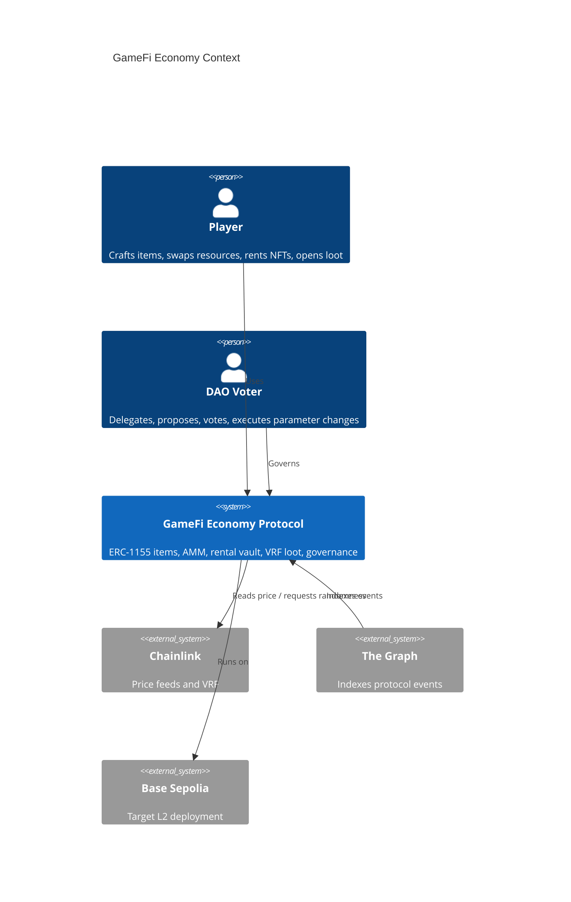
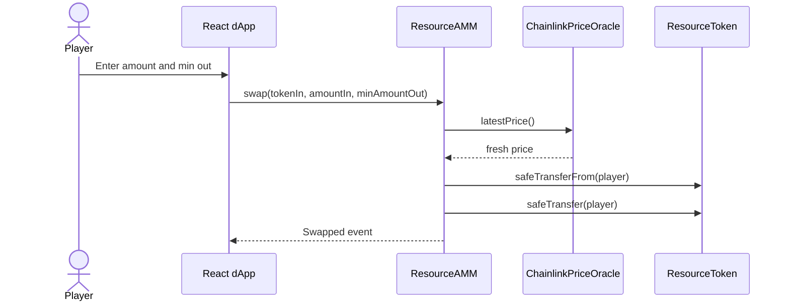
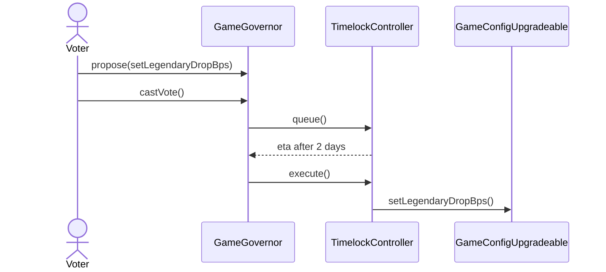
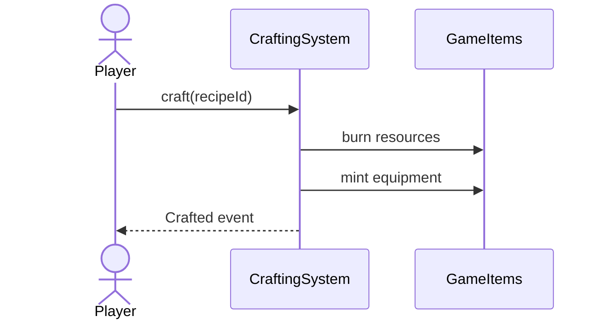

# Architecture Document Draft

## System Context



## Component Model

```mermaid
flowchart LR
  "React dApp" --> "GameGovernor"
  "React dApp" --> "ResourceAMM"
  "React dApp" --> "RentalVault"
  "React dApp" --> "The Graph Subgraph"
  "GameGovernor" --> "TimelockController"
  "TimelockController" --> "GameConfigUpgradeable UUPS Proxy"
  "TimelockController" --> "LootDrop"
  "TimelockController" --> "CraftingSystem"
  "ResourceAMM" --> "ResourceToken WOOD"
  "ResourceAMM" --> "ResourceToken CRYSTAL"
  "ResourceAMM" --> "ChainlinkPriceOracle"
  "LootDrop" --> "Chainlink VRF"
  "CraftingSystem" --> "GameItems ERC1155"
  "RentalVault" --> "GameItems ERC1155"
```

## Critical Flows

### Swap



### Propose, Vote, Execute



### Craft Item



## Storage Layout

- `GameConfigUpgradeable`: `craftingFeeBps`, `legendaryDropBps`, `oracleStaleAfter`, `__gap`. V2 adds `rentalFeeBps` after the reserved V1 layout, preventing collision.
- `ResourceAMM`: immutable token addresses, oracle address, LP ERC20 storage inherited from OpenZeppelin.
- `RentalVault`: `nextRentalId`, `rentals`, ERC4626 share accounting.
- `CraftingSystem`: `nextRecipeId`, `recipes`.
- `LootDrop`: VRF config, `legendaryDropBps`, `requestPlayer`.

## Trust Assumptions

The Timelock is the owner/admin for protocol parameters. Individual deployer admin rights are revoked after deployment. If the Timelock is compromised, the attacker can change drop rates, pause or unpause configurable modules, and upgrade the UUPS implementation after the delay.

## Design Decisions

ADR-001: Use ERC1155 for items because resource stacks and equipment can share one token contract.

ADR-002: Build x\*y=k AMM from scratch because the rubric requires a DeFi primitive rather than a fork.

ADR-003: Use UUPS only for protocol parameters, limiting upgradeable storage risk to a small contract.

ADR-004: Use The Graph for history-heavy views while the dApp reads live balances directly from contracts.
